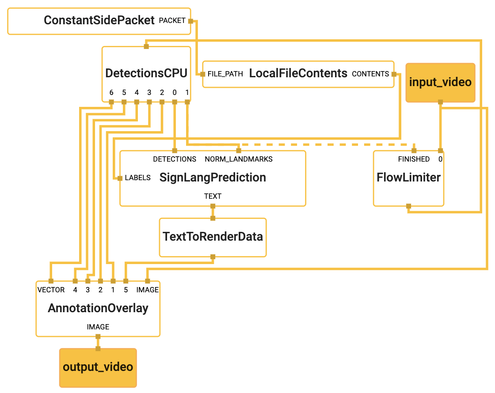

# SignLanguageRecognition

This repository contains a variety of tools to build up a experimental ecosystem for recognizing signs of the german sign language (DGS).
Our claim is an experimental attempt at live subtitling of gestures.
For this we train a deep learning model (RNN) for predicting the actual signs made by a person filmed.
Therefore we use [MediaPipe](https://github.com/google/mediapipe), a framework for building ML pipelines, to extract face and hand positions, including multiple coordinates for each finger.

**Caution: We do many changes at the moment. The documentation is not up-to-date! Please consider this, when running the code.**

## Table of contents
1. [Demo Video](#demo-video)
2. [Supported Words](#supported-words)
3. [Help us](#help-us)
4. [Requirements](#requirements)
5. [Installation](#installation)
6. [Build & Run Demo](#demo-build-and-run)
7. [Workflow](#workflow)

## Demo Video

## Supported Words
The following table lists all supported words with a link to [SignDict](https://signdict.org) and the english translation.

| German | English 
| --- | --- | 
[Bier](https://signdict.org/entry/102-bier) | Beer 
[Computer](https://signdict.org/entry/131-computer) | Computer 
[Deutschland](https://signdict.org/entry/149-deutschland) | Germany 
[du](https://signdict.org/entry/1427) | you
[essen](https://signdict.org/entry/1553) | (to) eat
[Foto](https://signdict.org/entry/1655-foto) | Photo
[Fußball](https://signdict.org/entry/251) | Soccer
[gestern](https://signdict.org/entry/251) | yesterday
[haben](https://signdict.org/entry/4301-haben) | (to) have
[Hallo](https://signdict.org/entry/293) | Hello
[Haus](https://signdict.org/entry/1913-haus) | House
[heute](https://signdict.org/entry/1945-heute) | today
[Hose](https://signdict.org/entry/1979-hose) | Pants
[Hunger](https://signdict.org/entry/325-hunger) | Hunger
[ich](https://signdict.org/entry/1993) | Me
[Land](https://signdict.org/entry/2300) | Country
[lernen](https://signdict.org/entry/2332-lernen) | (to) learn
[lieben](https://signdict.org/entry/2347) | (to) love
[Mainz](https://signdict.org/entry/2406) | Mainz (city in germany)
[morgen](https://signdict.org/entry/4535) | tomorrow
[rennen](https://signdict.org/entry/2880) | (to) run
[Software](https://signdict.org/entry/3165) | Software
[Sonne](https://signdict.org/entry/672) | Sun
[Tag](https://signdict.org/entry/711) | Day
[trinken](https://signdict.org/entry/3415) | (to) drink
[Universität](https://signdict.org/entry/3478) | University
[unser](https://signdict.org/entry/3483) | our(s)
[Welt](https://signdict.org/entry/3672) | World
[Wetter](https://signdict.org/entry/797) | Weather
[zeigen](https://signdict.org/entry/3776) | (to) show

## Help us
If you want to help us, please check out our website for training videos, [Gebaerdenfutter.de](https://gebaerdenfutter.de).
We'd love to see your video contributions, so recognizing more words would be possible!
Sadly, the website is only available in german language.
After registration, we have to activate your account. You'll get an email.

## Requirements 

1. Ubuntu 18.04 (other version may not work)
2. GPU with OpenGL ES 3.1+ support
3. Camera with a minimum resolution of 640x480 @ 30fps

## Installation
### For Demo
1. Follow the instructions to [install MediaPipe](https://google.github.io/mediapipe/getting_started/install).
Note that bazel version 3.5.0 is not supported, we recommend using 3.4.1.
Make sure, you can build and run MediaPipe GPU examples, see <https://google.github.io/mediapipe/getting_started/building_examples.html#option-2-running-on-gpu>
2. Clone the repository
### Optional: To work with the code
1. To work with the `jupyter notebooks`, we recommend to install [Anaconda](https://www.anaconda.com/).
2. Install `TensorFlow 2.2.0` with `conda`, see <https://anaconda.org/anaconda/tensorflow-gpu>

## Demo: Build and Run
1. Open a terminal within the repository and navigate to the src folder: `cd src/`
2. Build the demo with `./build_prediction.sh`
3. Run the demo with `./run_prediction.sh`
4. Exit the application with <kbd>Strg</kbd> + <kbd>C</kbd>

## Workflow

### 1. Gathering video examples

For training we need many videos for each sign, we want to predict. Those examples are generated by users of our platform [Gebärdenfutter](https://gebaerdenfutter.de).

### 2. Extracting face and hand positions

For extracting multi hand and face detections for each frame of the videos and saving them, we built a pipeline with `MediaPipe`, e.g. have a look at the `DetectionsToCSVCalculator`, we implemented. It simply writes out the detections made by `MediaPipe` to CSV files.

### 3. Training deep learning model

The CSV files are used to train a deep learning model with `Keras`, a high level API for `TensorFlow`.
To find best hyperparameter sets we use Weights&Biases' Sweeps.
Check out the `lab` folder.

### 4. Live prediction (Subtitling) ***Work in progress***

Visualization of MediaPipe Graph

The trained model is used for predicting live video stream. See the `SignLangRecognitionCalculator` for further details on how we try to use the model for live predictions. Currently it's not working well, like we expected before, but it provides us an infrastructure for experiments and testing. You've got ideas for improvements? Let us know!
